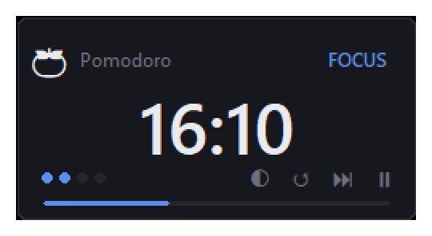
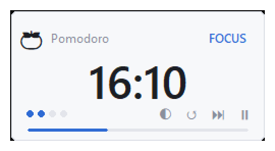
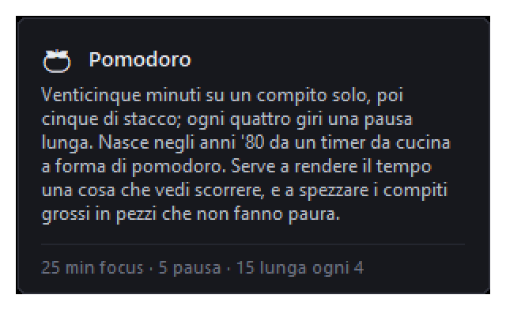
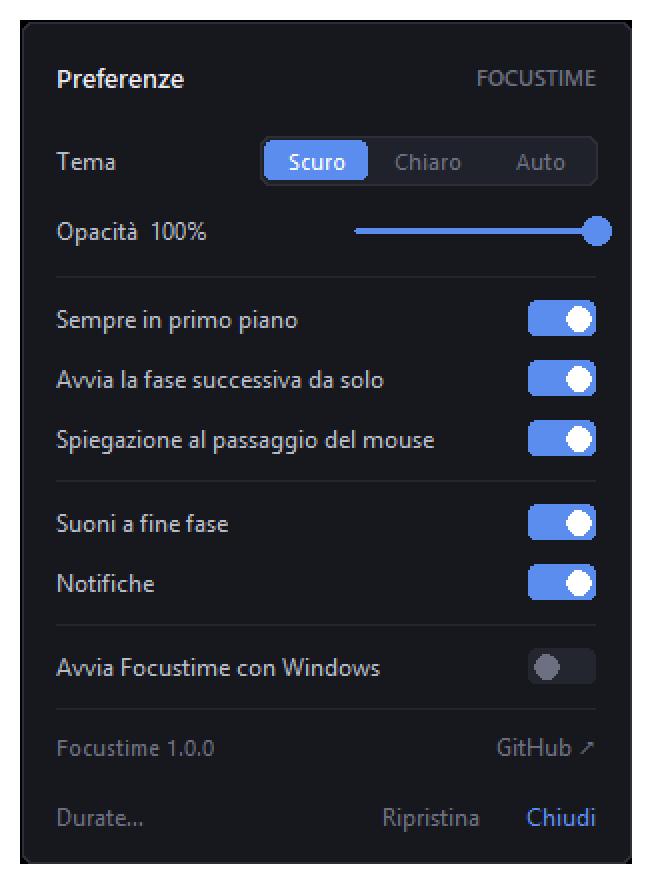
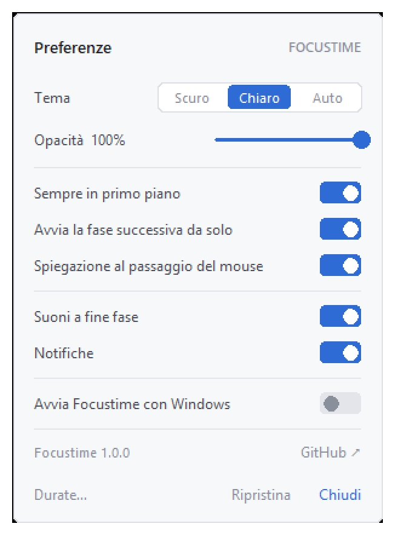
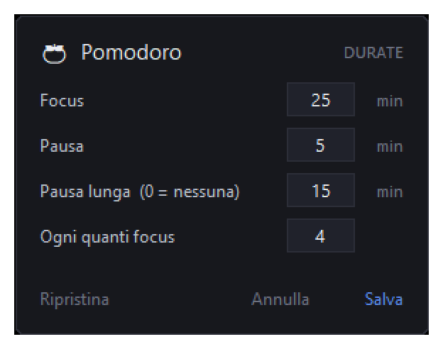

<div align="center">


# Focustime

Timer minimale per la concentrazione, per Windows.
Cinque tecniche, una finestra piccolissima, nessuna distrazione.





</div>

## Cos'è

Una finestra da 250×128 pixel, senza bordi, sempre in primo piano, che puoi
trascinare dove vuoi. Dentro c'è il countdown, l'emoji della tecnica che stai
usando e quattro comandi. Nient'altro.

Non raccoglie dati, non si collega a internet, non chiede account. È un file
Python da poco più di mille righe che usa solo la libreria standard.

## Installazione

**Con l'eseguibile** — scarica `Focustime.exe` dalla
[pagina dei rilasci](https://github.com/LRforgeKR/Focustime/releases), mettilo
dove preferisci e fai doppio click. Non serve installare nulla, nemmeno Python.

> Al primo avvio Windows potrebbe mostrare "Windows ha protetto il PC": è
> normale per un eseguibile senza firma digitale. Clicca *Ulteriori
> informazioni* → *Esegui comunque*.

**Dai sorgenti** — serve Python 3.10 o successivo (Tkinter è già incluso
nell'installazione standard per Windows):

```bash
git clone https://github.com/LRforgeKR/Focustime.git
cd Focustime
py focustime.pyw
```

## Le cinque tecniche

| | Tecnica | Ciclo | Quando conviene |
|---|---|---|---|
| 🍅 | **Pomodoro** | 25′ / 5′, pausa lunga da 15′ ogni 4 giri | Compiti frammentabili, procrastinazione |
| ⚡ | **52 / 17** | 52′ / 17′ | Giornata normale al computer |
| 🌊 | **Ultradian** | 90′ / 20′ | Lavoro profondo, studio pesante |
| 🌀 | **Flowtime** | cronometro libero, pausa = lavoro ÷ 5 | Se odi essere interrotto a metà |
| 🎬 | **Animedoro** | 40′ / 20′ di pausa lunga | Sera, compiti noiosi: la pausa è il premio |

Passando il mouse sul nome della tecnica compare una scheda che spiega da dove
viene e a cosa serve.

<div align="center">

</div>

## Comandi

| Azione | Come |
|---|---|
| Cambiare tecnica | click sull'emoji in alto a sinistra |
| Leggere cos'è la tecnica | passa il mouse sul nome, o cliccalo |
| Avviare / mettere in pausa | ▶ ⏸, doppio click sulla finestra, o barra spaziatrice |
| Saltare alla fase successiva | ⏭ |
| Ricominciare la fase corrente | ↺ |
| Tema chiaro / scuro | ◐, oppure `Ctrl+T` |
| Impostazioni | click destro → Preferenze… |
| Cambiare le durate | click destro → Personalizza le durate… |
| Spostare la finestra | trascinala da un punto qualsiasi |
| Uscire | click destro → Esci, oppure `Ctrl+Q` |

In Flowtime il cronometro sale invece di scendere: ⏭ chiude il focus e calcola
la pausa in base a quanto hai lavorato (fra 3 e 30 minuti).

## Preferenze

<div align="center">


</div>

- **Tema** — Scuro, Chiaro o Auto (segue l'impostazione di Windows e si adegua
  anche se la cambi mentre l'app è aperta)
- **Opacità della finestra** — da 55% a 100%
- **Sempre in primo piano**
- **Avvia la fase successiva da solo** — se lo spegni, a fine fase il timer
  aspetta che sia tu a premere ▶
- **Spiegazione al passaggio del mouse**
- **Suoni a fine fase** — due note brevi a ogni cambio
- **Notifiche** — riquadro in basso a destra per qualche secondo
- **Avvia Focustime con Windows** — crea o rimuove un collegamento nella
  cartella Esecuzione automatica dell'utente, senza toccare il registro

## Durate personalizzate

<div align="center">

</div>

Ogni tecnica tiene le sue durate. Metti `0` alla pausa lunga per toglierla del
tutto. `Invio` salva, `Esc` chiude, **Ripristina** rimette i valori di fabbrica.
Un valore fuori scala colora il campo di rosso e blocca il salvataggio.

## Più monitor

Spiegazione, editor e notifiche compaiono sul monitor dove si trova la
finestra, non su quello principale. La posizione viene ricordata anche fra
schermi diversi; se al riavvio quel monitor non c'è più, la finestra torna in
basso a destra sul principale.

## Impostazioni

Tecnica, tema, opacità, durate personalizzate e posizione della finestra
finiscono in un `settings.json` accanto all'applicazione, scritto a ogni
modifica. Per ripartire da zero basta cancellarlo.

## Compilare l'eseguibile

```bash
py -m pip install pyinstaller
py -m PyInstaller --onefile --windowed --icon focustime.ico --name Focustime focustime.pyw
```

L'eseguibile finisce in `dist/Focustime.exe` e si porta dentro tutto il
necessario.

## Licenza

[MIT](LICENSE) — puoi usarlo, modificarlo e ridistribuirlo liberamente,
mantenendo l'avviso di copyright.
